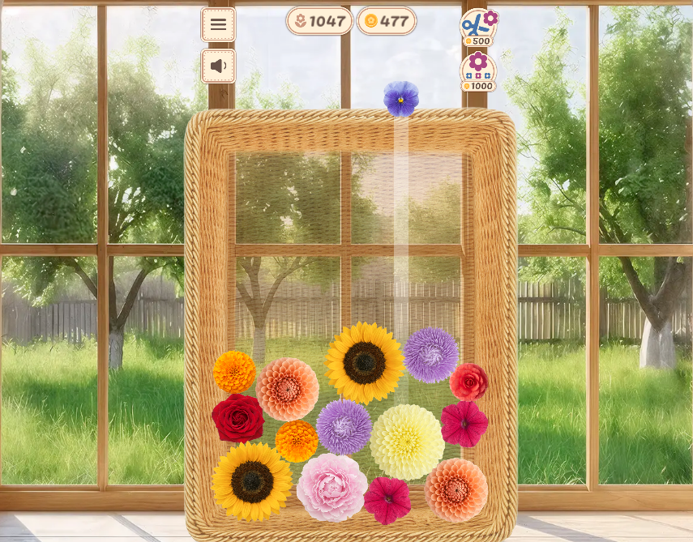

# 🌸 My Favorite Dacha

> A Suika-style merge puzzle game built with Unity — drop flowers into a basket, merge identical ones, and grow the biggest bloom.



**[▶ Play in Browser on itch.io](https://cutecootgames.itch.io/my-favorite-dacha)**

---

## About

My Favorite Dacha is a cozy merge-puzzle game inspired by Suika Game (Watermelon Game). Instead of fruits, you drop hand-crafted flowers into a wicker basket. Same-type flowers merge into larger, rarer blooms — the goal is to survive as long as possible without overflowing.

Built as a solo indie project by a developer coming from 10+ years of UI/UX design. The focus was on bridging high-end visual design with clean, scalable game architecture.

---

## Gameplay

- Drop a flower from the top — it falls with realistic physics
- Two identical flowers that touch each other merge into a bigger one
- Chain merges to score higher and climb the leaderboard
- Game ends when flowers overflow the basket

---

## Tech Stack

| | |
|---|---|
| **Engine** | Unity (C#) |
| **Rendering** | UGUI, ShaderLab, HLSL |
| **Physics** | Unity 2D Physics (Rigidbody2D, Collider2D) |
| **Build Target** | WebGL (browser), Mobile |
| **Version Control** | Git / GitHub |

---

## Architecture

The project uses a clean event-driven architecture designed for scalability and easy iteration:

- **Singleton** — global managers (GameManager, AudioManager, ScoreManager) with a single point of access
- **Observer / Event Bus (Signal Bus)** — decoupled communication between gameplay systems; merges, score updates, and UI reactions are all event-driven with no hard dependencies
- **Object Pooling** — flowers are pooled rather than instantiated/destroyed to keep WebGL performance stable

---

## Key Features

- **Adaptive UGUI** — all interfaces built from scratch, pixel-perfect on both mobile and desktop browser
- **Custom shaders** — ShaderLab/HLSL shaders for the basket glass effect and flower glow on merge
- **WebGL optimization** — texture atlas management, particle budget caps, profiler-guided performance tuning
- **Save system** — JSON-based persistent score and session state
- **Physics-driven merge detection** — collision-based trigger system for reliable same-type pairing

---

## Project Structure

```
SuikaGameUnity/
└── Assets/
    ├── Scripts/
    │   ├── Core/          # GameManager, ScoreManager, AudioManager
    │   ├── Gameplay/      # Flower logic, merge system, drop controller
    │   ├── UI/            # HUD, menus, score display
    │   └── Utils/         # Event bus, pooling, helpers
    ├── Shaders/           # Custom ShaderLab / HLSL
    ├── Prefabs/           # Flower prefabs (11 types)
    └── Scenes/
        └── Game.unity
```

---

## About the Developer

**Anton Kuzan** — Unity Developer with 10+ years of UI/UX background (ex-Lead Designer at Aristek Systems).

This project is part of **Cute Coot Games** — an indie studio focused on casual and mid-core games with high UI quality.

- [LinkedIn](https://www.linkedin.com/in/antonkuzan)
- [itch.io](https://cutecootgames.itch.io)
- [Behance](https://www.behance.net/akuzan)

---

## License

This project is for portfolio and learning purposes. Assets (flower artwork, audio) are not licensed for reuse.
