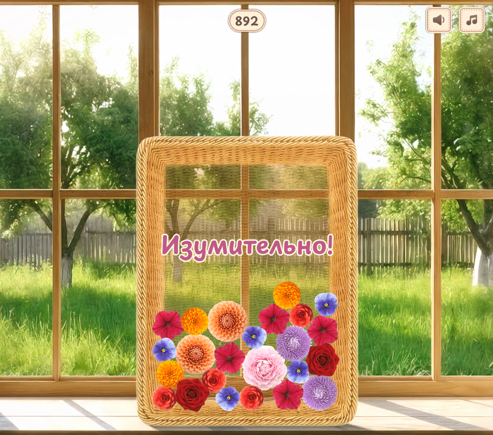

# 🌸 My Favorite Dacha

> **Suika-style merge puzzle** with a focus on clean architecture, high-end UI, and polished game feel.

**[▶ Play in Browser (Yandex Games - Coming Soon)](#)** | **[▶ Play on itch.io](https://cutecootgames.itch.io/my-favorite-dacha)**

---

## 🛠 Project Overview

This is a portfolio-grade Unity project demonstrating a transition from "working prototype" to **production-ready architecture**.
The game is a cozy merge-puzzle where players drop hand-crafted flowers into a basket. Identical flowers merge into larger blooms using 2D physics.

### Key Technical Goals:

- **Decoupled Systems:** Moving away from MonoBehaviour-heavy logic to pure C# classes.
- **Scalable Architecture:** Implementing a robust entry point and service-based dependency management.
- **Web Performance:** Optimized for WebGL (Yandex Games / itch.io) with memory and draw-call management.

---

## 🏗 Architecture & Patterns

The project is currently undergoing a major refactoring to meet **Middle-level** standards:

- **Global App Lifecycle:** Uses `[RuntimeInitializeOnLoadMethod]` for a scene-independent entry point (**Bootstrap**). No more "start from specific scene" dependency.
- **Minimalist DI / Service Locator:** Centralized access to global systems (`AudioManager`, `SaveManager`, etc.) via a `Services` registry, reducing tight coupling and avoiding "Singleton spaghetti".
- **Event-Driven Communication:** A global `GameEvents` bus allows systems to talk without knowing about each other (e.g., `MergeManager` doesn't know `ScoreManager` exists).
- **Data-Driven Design:** Game balance, flower stats, and audio configurations are entirely managed via **ScriptableObjects**.

---

## 💻 Tech Stack

- **Engine:** Unity 2022.3+ (URP)
- **Code Style:** Clean C#, **Conventional Commits**, Namespace-based organization.
- **Input:** New Unity Input System.
- **UI:** UGUI with an adaptive layout for Mobile/Web.
- **Physics:** 2D Physics with custom collision filtering.

---

## 📂 Project Structure

Assets/
├── \_Project/
│ ├── Art/ # Sprites, Materials, Shaders
│ ├── Audio/ # Configs and Samples
│ ├── Configs/ # ScriptableObject Data (Flowers, Balance)
│ ├── Prefabs/ # Game entities and UI elements
│ ├── Resources/ # [GlobalContext] for app initialization
│ ├── Scenes/ # Bootstrap and Main levels
│ └── Scripts/
│ ├── Core/ # App initialization and Service Locator
│ ├── Gameplay/ # Merge logic, Spawner, Physics
│ ├── UI/ # View components and HUD
│ └── Utils/ # Event Bus, Extensions, Helpers
└── Plugins/ # Third-party assets (TextMesh Pro, etc.)

---

## 📈 Roadmap (In Progress)

- [x] Scene-independent Bootstrap.
- [x] Minimalist Dependency Injection (Service Locator).
- [ ] Refactoring Input System as a global service.
- [ ] Yandex Games SDK integration & Cloud Saves.
- [ ] Combo system with dynamic audio pitch shifting.
- [ ] Localization system (RU/EN).

---

## 👨‍💻 About the Developer

**Anton Kuzan** — Unity Developer & UI/UX Specialist.
Ex-Lead Designer with 10+ years of experience, now focusing on building high-quality game architectures.

- [LinkedIn](https://www.linkedin.com/in/antonkuzan)
